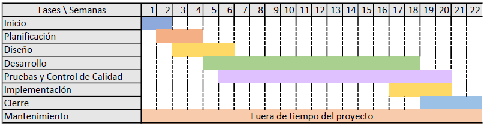
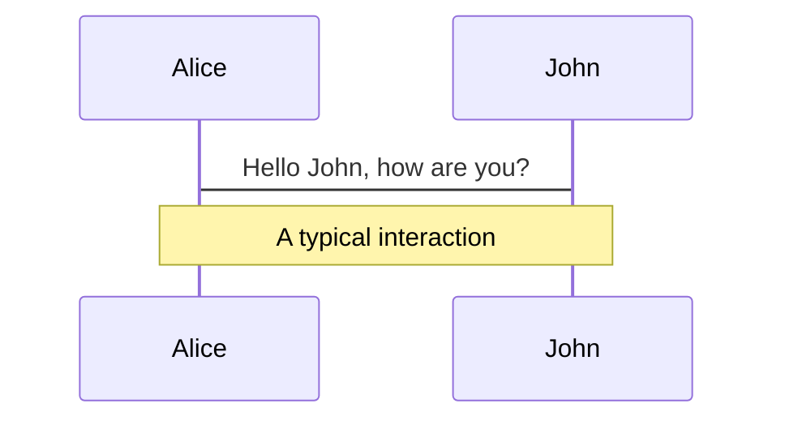
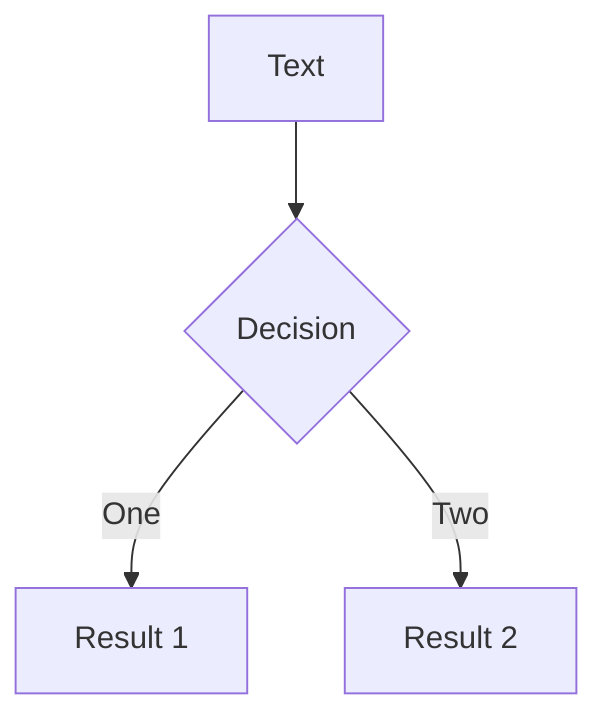
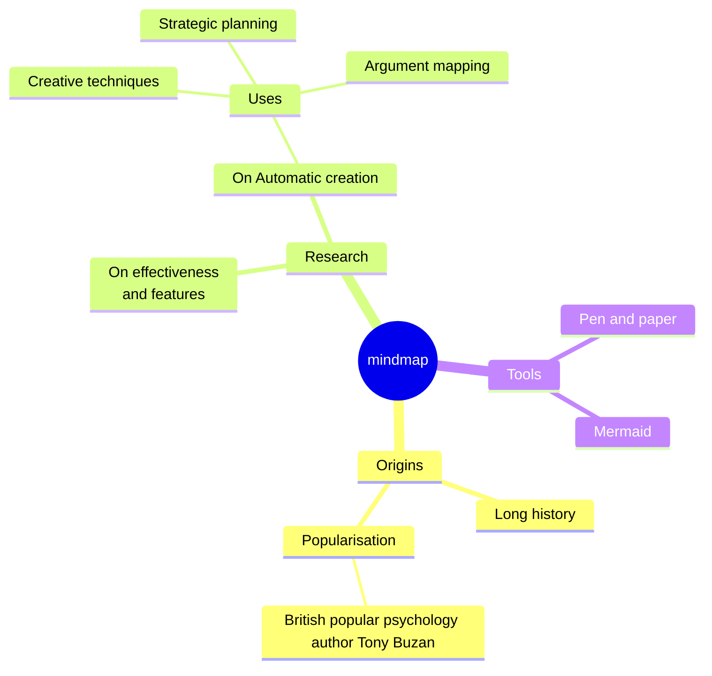
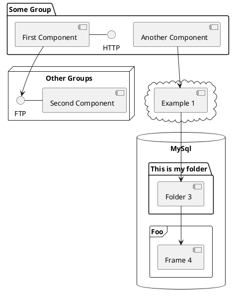

---
# You can also start simply with 'default'
theme: penguin
# random image from a curated Unsplash collection by Anthony
# like them? see https://unsplash.com/collections/94734566/slidev
background: https://cover.sli.dev
# some information about your slides (markdown enabled)
title: Welcome to Slidev
info: |
  ## Slidev Starter Template
  Presentation slides for developers.

  Learn more at [Sli.dev](https://sli.dev)
# apply unocss classes to the current slide
class: text-center
# https://sli.dev/features/drawing
drawings:
  persist: false
# slide transition: https://sli.dev/guide/animations.html#slide-transitions
transition: slide-left
# enable MDC Syntax: https://sli.dev/features/mdc
mdc: true
layout: intro
---

# E-Learning by Platypus Sys. Inc.

Portal Web de E-Learning para ROMMOS S.R.L.

<div class="pt-12">
  <span @click="$slidev.nav.next" class="px-2 py-1 rounded cursor-pointer" hover="bg-white bg-opacity-10">
    <carbon:arrow-right class="inline"/>
  </span>
</div>

<!--<div class="abs-br m-6 flex gap-2">
  <button @click="$slidev.nav.openInEditor()" title="Open in Editor" class="text-xl slidev-icon-btn opacity-50 !border-none !hover:text-white">
    <carbon:edit />
  </button>
  <a href="https://github.com/slidevjs/slidev" target="_blank" alt="GitHub" title="Open in GitHub"
    class="text-xl slidev-icon-btn opacity-50 !border-none !hover:text-white">
    <carbon-logo-github />
  </a>
</div>-->

<!--
Buenos días a todos los presentes. Somos Platypus Systems Incorporated. Realizarmos un P
-->

---
layout: new-section
---

# Plan de Proyecto

---

# ¿Qué haremos en cada Fase?  
5 meses, aprox. 22 semanas

- 📝 **Inicio - Semanas 1 a 2**  
  Reunión inicial con ROMMOS S.R.L. para definir objetivos específicos, y funcionalidades principales (gestión de cursos, usuarios y noticias).  
  Identificación de partes interesadas y asignación de roles clave dentro de Platypus Systems y ROMMOS.  
  Recepción de la carta de aceptación y aprobación de los términos acordados en ella, que incluye límites, responsabilidades, costos, entre otros .  

- 🤹 **Planificación - Semanas 2 a 4**  
  Desarrollo del plan de proyecto detallado, alineado con la metodología SCRUM.    
  Selección y confirmación de tecnologías: frameworks para desarrollo frontend y backend.  
  Análisis y planificación de riesgos, incluyendo mitigación para dependencia de servicios externos (hosting, internet y base de datos de ROMMOS S.R.L.).

---

- 🎨 **Diseño - Semanas 3 a 6**  
Desarrollo de la identidad visual basada en la imagen corporativa de ROMMOS S.R.L.  
Creación de wireframes y mockups para las interfaces de usuario, como ser: página de inicio, sección de cursos y talleres, panel de usuario, noticias y contacto.  
Creación de diagramas UML de: casos de uso, clases, secuencia, actividades, componentes y estados.
Mockup de la funcionalidad de inscripción de usuarios con integración de tarjeta de crédito.  
Revisión y aprobación de los mockups por parte de ROMMOS, incluyendo iteraciones necesarias para ajustes.    

- 🧑‍💻 **Desarrollo - Semanas 5 a 18**  
Dividido en 7 Sprints de 2 semanas.  
Configuración inicial del hosting y conexión con la base de datos proporcionada por ROMMOS.  
Conexión a BudPay API para realizar cobros a tarjetas de crédito.  
Desarrollo de los módulos determinados:  
  - **Módulos Comunes**: Página de inicio, panel de usuario, login, sign-up con pasarela de pago, secciones de contacto y noticias (feedback en noticias), y menú de navegación.
  - **Módulos de Estudiante**: Sección de cursos y talleres (gestión de inscripciones, progreso y calificaciones).
  - **Módulos de Administrador**: Herramientas para gestionar cursos, gestionar inscritos, y publicar noticias.  

---

- 🛠 **Pruebas y Control de Calidad - Semanas 6 a 20**  
Pruebas de funcionalidad: Asegurar que todas las funcionalidades (módulos comunes, de estudiantes y de administradores) operan según lo planeado.  
Pruebas de rendimiento: Optimización del tiempo de carga y estabilidad para su uso exclusivo en computadoras y laptops.  
Pruebas de compatibilidad: Verificar comportamiento en navegadores compatibles.  
Resolución de problemas técnicos identificados durante las pruebas.  

- 📤 **Implementación - Semanas 17 a 20**  
Configuración del entorno de producción en el servidor de hosting seleccionado por ROMMOS.  
Despliegue de la plataforma en línea con un monitoreo inicial del desempeño.  
Implementación de ajustes finales según retroalimentación inicial tras el lanzamiento.

---

- 🌟 **Cierre - Semanas 19 a 22**  
Entrega formal del sistema a ROMMOS S.R.L., acompañado de manuales para usuarios y administradores.  
Capacitación: Asistencia al equipo de ROMMOS en el uso de las herramientas de gestión (cursos, noticias y usuarios).  
Documentación final del proyecto: detalles técnicos, configuraciones, y procedimientos de mantenimiento recomendados.  
Revisión de lecciones aprendidas entre los equipos de Platypus Systems y ROMMOS para proyectos futuros.  

- 🛡️ **Mantenimiento - 1 mes desde el Cierre**  
Soporte técnico inicial: Supervisión del sistema durante el primer mes posterior al lanzamiento para resolver errores no detectados en las pruebas.  
Actualizaciones menores: Ajustes en la interfaz o funcionalidad, según lo definido en la Carta de Aceptación y subsecuentes adendas.  
Documentación adicional: Registro de problemas reportados y soluciones implementadas.  

---
level: 2
---

# Diagrama de Gantt



---

# Herramientas

Hover on the bottom-left corner to see the navigation's controls panel, [learn more](https://sli.dev/guide/ui#navigation-bar)

## Keyboard Shortcuts

|                                                    |                             |
| -------------------------------------------------- | --------------------------- |
| <kbd>right</kbd> / <kbd>space</kbd>                | next animation or slide     |
| <kbd>left</kbd> / <kbd>shift</kbd><kbd>space</kbd> | previous animation or slide |
| <kbd>up</kbd>                                      | previous slide              |
| <kbd>down</kbd>                                    | next slide                  |

---
layout: new-section
---

# Nuestro Equipo

---
layout: presenter
presenterImage: 'https://res.cloudinary.com/alvarosaburido/image/upload/v1622370075/as-portfolio/alvaro_saburido.jpg'
---

# Dylan Jitton

---
layout: presenter
presenterImage: 'https://res.cloudinary.com/alvarosaburido/image/upload/v1622370075/as-portfolio/alvaro_saburido.jpg'
---

# Vivian Marino

---
layout: presenter
presenterImage: 'https://res.cloudinary.com/alvarosaburido/image/upload/v1622370075/as-portfolio/alvaro_saburido.jpg'
---

# Luis Paricollo

---
layout: presenter
presenterImage: 'https://res.cloudinary.com/alvarosaburido/image/upload/v1622370075/as-portfolio/alvaro_saburido.jpg'
---

# Katzumi Urdininea

---
layout: two-cols
layoutClass: gap-16
---

# Table of contents

You can use the `Toc` component to generate a table of contents for your slides:

```html
<Toc minDepth="1" maxDepth="1"></Toc>
```

The title will be inferred from your slide content, or you can override it with `title` and `level` in your frontmatter.

::right::

<Toc v-click minDepth="1" maxDepth="2"></Toc>

---

layout: image-right
image: https://cover.sli.dev

---

# Code

Use code snippets and get the highlighting directly, and even types hover!

```ts {all|5|7|7-8|10|all} twoslash
// TwoSlash enables TypeScript hover information
// and errors in markdown code blocks
// More at https://shiki.style/packages/twoslash

import { computed, ref } from 'vue'

const count = ref(0)
const doubled = computed(() => count.value * 2)

doubled.value = 2
```

<arrow v-click="[4, 5]" x1="350" y1="310" x2="195" y2="334" color="#953" width="2" arrowSize="1" />

<!-- This allow you to embed external code blocks -->

<<< @/snippets/external.ts#snippet

<!-- Footer -->

[Learn more](https://sli.dev/features/line-highlighting)

<!-- Inline style -->
<style>
.footnotes-sep {
  @apply mt-5 opacity-10;
}
.footnotes {
  @apply text-sm opacity-75;
}
.footnote-backref {
  display: none;
}
</style>

<!--
Notes can also sync with clicks

[click] This will be highlighted after the first click

[click] Highlighted with `count = ref(0)`

[click:3] Last click (skip two clicks)
-->

---

## level: 2

# Shiki Magic Move

Powered by [shiki-magic-move](https://shiki-magic-move.netlify.app/), Slidev supports animations across multiple code snippets.

Add multiple code blocks and wrap them with <code>````md magic-move</code> (four backticks) to enable the magic move. For example:

````md magic-move {lines: true}
```ts {*|2|*}
// step 1
const author = reactive({
  name: 'John Doe',
  books: [
    'Vue 2 - Advanced Guide',
    'Vue 3 - Basic Guide',
    'Vue 4 - The Mystery'
  ]
})
```

```ts {*|1-2|3-4|3-4,8}
// step 2
export default {
  data() {
    return {
      author: {
        name: 'John Doe',
        books: [
          'Vue 2 - Advanced Guide',
          'Vue 3 - Basic Guide',
          'Vue 4 - The Mystery'
        ]
      }
    }
  }
}
```

```ts
// step 3
export default {
  data: () => ({
    author: {
      name: 'John Doe',
      books: [
        'Vue 2 - Advanced Guide',
        'Vue 3 - Basic Guide',
        'Vue 4 - The Mystery'
      ]
    }
  })
}
```

Non-code blocks are ignored.

```vue
<!-- step 4 -->
<script setup>
const author = {
  name: 'John Doe',
  books: [
    'Vue 2 - Advanced Guide',
    'Vue 3 - Basic Guide',
    'Vue 4 - The Mystery'
  ]
}
</script>
```
````

---

# Components

<div grid="~ cols-2 gap-4">
<div>

You can use Vue components directly inside your slides.

We have provided a few built-in components like `<Tweet/>` and `<Youtube/>` that you can use directly. And adding your custom components is also super easy.

```html
<Counter :count="10" />
```

<!-- ./components/Counter.vue -->
<Counter :count="10" m="t-4" />

Check out [the guides](https://sli.dev/builtin/components.html) for more.

</div>
<div>

```html
<Tweet id="1390115482657726468" />
```

<Tweet id="1390115482657726468" scale="0.65" />

</div>
</div>

<!--
Presenter note with **bold**, *italic*, and ~~striked~~ text.

Also, HTML elements are valid:
<div class="flex w-full">
  <span style="flex-grow: 1;">Left content</span>
  <span>Right content</span>
</div>
-->

---

## class: px-20

# Themes

Slidev comes with powerful theming support. Themes can provide styles, layouts, components, or even configurations for tools. Switching between themes by just **one edit** in your frontmatter:

<div grid="~ cols-2 gap-2" m="t-2">

```yaml
---
theme: default
---
```

```yaml
---
theme: seriph
---
```


</div>

Read more about [How to use a theme](https://sli.dev/guide/theme-addon#use-theme) and
check out the [Awesome Themes Gallery](https://sli.dev/resources/theme-gallery).

---

# Clicks Animations

You can add `v-click` to elements to add a click animation.

<div v-click>

This shows up when you click the slide:

```html
<div v-click>This shows up when you click the slide.</div>
```

</div>

<br>

<v-click>

The <span v-mark.red="3"><code>v-mark</code> directive</span>
also allows you to add
<span v-mark.circle.orange="4">inline marks</span>
, powered by [Rough Notation](https://roughnotation.com/):

```html
<span v-mark.underline.orange>inline markers</span>
```

</v-click>

<div mt-20 v-click>

[Learn more](https://sli.dev/guide/animations#click-animation)

</div>

---

# Motions

Motion animations are powered by [@vueuse/motion](https://motion.vueuse.org/), triggered by `v-motion` directive.

```html
<div
  v-motion
  :initial="{ x: -80 }"
  :enter="{ x: 0 }"
  :click-3="{ x: 80 }"
  :leave="{ x: 1000 }"
>
  Slidev
</div>
```

<div class="w-60 relative">
  <div class="relative w-40 h-40">
    
    
    
  </div>

  <div
    class="text-5xl absolute top-14 left-40 text-[#2B90B6] -z-1"
    v-motion
    :initial="{ x: -80, opacity: 0}"
    :enter="{ x: 0, opacity: 1, transition: { delay: 2000, duration: 1000 } }">
    Slidev
  </div>
</div>

<!-- vue script setup scripts can be directly used in markdown, and will only affects current page -->
<script setup lang="ts">
const final = {
  x: 0,
  y: 0,
  rotate: 0,
  scale: 1,
  transition: {
    type: 'spring',
    damping: 10,
    stiffness: 20,
    mass: 2
  }
}
</script>

<div
  v-motion
  :initial="{ x:35, y: 30, opacity: 0}"
  :enter="{ y: 0, opacity: 1, transition: { delay: 3500 } }">

[Learn more](https://sli.dev/guide/animations.html#motion)

</div>

---

# LaTeX

LaTeX is supported out-of-box. Powered by [KaTeX](https://katex.org/).

<div h-3 />

Inline $\sqrt{3x-1}+(1+x)^2$

Block

$$
{1|3|all}
\begin{aligned}
\nabla \cdot \vec{E} &= \frac{\rho}{\varepsilon_0} \\
\nabla \cdot \vec{B} &= 0 \\
\nabla \times \vec{E} &= -\frac{\partial\vec{B}}{\partial t} \\
\nabla \times \vec{B} &= \mu_0\vec{J} + \mu_0\varepsilon_0\frac{\partial\vec{E}}{\partial t}
\end{aligned}
$$

[Learn more](https://sli.dev/features/latex)

---

# Diagrams

You can create diagrams / graphs from textual descriptions, directly in your Markdown.

<div class="grid grid-cols-4 gap-5 pt-4 -mb-6">









</div>

Learn more: [Mermaid Diagrams](https://sli.dev/features/mermaid) and [PlantUML Diagrams](https://sli.dev/features/plantuml)

---

foo: bar
dragPos:
square: 691,32,167,\_,-16

---

dragPos:
square: 0,-376,0,0

---

dragPos:
square: 0,-252,0,0

---

dragPos:
square: 0,-252,0,0

---
dragPos:
  square: 0,-252,0,0
---

# Draggable Elements

Double-click on the draggable elements to edit their positions.

<br>

###### Directive Usage

```md

```

<br>

###### Component Usage

```md
<v-drag text-3xl>
  <carbon:arrow-up />
  Use the `v-drag` component to have a draggable container!
</v-drag>
```

<v-drag pos="650,214,261,_,-15"undefinedundefinedundefinedundefinedundefinedundefinedundefinedundefinedundefinedundefinedundefinedundefinedundefinedundefinedundefinedundefinedundefinedundefinedundefinedundefinedundefinedundefinedundefinedundefinedundefinedundefinedundefined>

  <div text-center text-3xl border border-main rounded>
    Double-click me!
  </div>
</v-drag>


###### Draggable Arrow

```md
<v-drag-arrow two-way />
```

<v-drag-arrow pos="67,452,253,46" two-way op70 />

---

src: ./pages/imported-slides.md
hide: false

---


---

# Monaco Editor

Slidev provides built-in Monaco Editor support.

Add `{monaco}` to the code block to turn it into an editor:

```ts {monaco}
import { ref } from 'vue'
import { emptyArray } from './external'

const arr = ref(emptyArray(10))
```

Use `{monaco-run}` to create an editor that can execute the code directly in the slide:

```ts {monaco-run}
import { version } from 'vue'
import { emptyArray, sayHello } from './external'

sayHello()
console.log(`vue ${version}`)
console.log(emptyArray<number>(10).reduce(fib => [...fib, fib.at(-1)! + fib.at(-2)!], [1, 1]))
```

---

layout: center
class: text-center

---

# Learn More

[Documentation](https://sli.dev) · [GitHub](https://github.com/slidevjs/slidev) · [Showcases](https://sli.dev/resources/showcases)

<PoweredBySlidev mt-10 />
