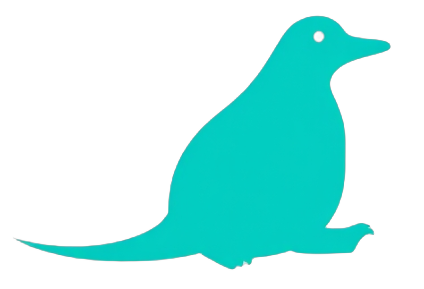

# Software by Platypus Systems

Emprendimiento de Desarrollo de Soluciones Tecnológicas

  
    <carbon:arrow-right class="inline"/>
  

<!--
Buenos días a todos los presentes. Somos Platypus Systems Incorporated. Realizarmos un P
-->

---

# Tabla de Contenidos

<Toc minDepth="1" maxDepth="2"></Toc>

---
layout: new-section
---

# Nuestro Emprendimiento

---
level: 2
---

# Documentación

* [Misión, Visión, Quiénes somos](https://docs.google.com/document/d/1fiNvie4f4gH7xABMu8jXinjvp0cbJ3A5IY-xnh3dtFI/edit?usp=sharing)
* [Organización de la empresa](https://app.diagrams.net/#G10RebVOkM0O7HaifjOG1rcPRDSETr0MVK#%7B%22pageId%22%3A%22uFa4GupU5kZWHak2X5UW%22%7D)
* [Manual de Funciones](https://docs.google.com/document/d/14ShyhXMCXaSTV2JYQ5REilLzAWeTbnnsZXhC-buWoAs/edit?usp=drive_link)
* [Manual de Actividades](https://docs.google.com/document/d/18DbV53QGuGSWf8MrxYpQ2IP7QOrWgd2Q4Om9qLF3_8c/edit?usp=drive_link)
* [Análisis de Costos](https://docs.google.com/spreadsheets/d/1SxBb5oo3Qe_yJMZRhd-E4laOWdaNGZjh/edit?usp=drive_link&ouid=117872500759688773079&rtpof=true&sd=true)
* [Matriz de riesgos](https://docs.google.com/spreadsheets/d/1BVXMZZxp3zf8E4OU01ht3GMvO51VrnIpcaFxhFCa7Xg/edit?usp=drive_link)
* [Plan de Proyecto](https://docs.google.com/document/d/1eNHDRYE8go9aDiz220NRmxi36v--eYShYpWUFJxm0bM/edit?usp=drive_link)
* [Cronogramas y herramientas](https://docs.google.com/spreadsheets/d/1kMYsyjuisyeuWlQUwh1o1Ww485PcsXMbyG-IxNFX7-k/edit?usp=drive_link)
* [Control de Calidad](https://drive.google.com/file/d/1HTqCRQpXecUBSSQIBFtfUH-efXD1sCxE/view?usp=drive_link)
* [Plan de Sostenibilidad](https://drive.google.com/file/d/1HTqCRQpXecUBSSQIBFtfUH-efXD1sCxE/view?usp=drive_link)

---

<h1>Equipos (Hardware)</h1>

|                                                    |                             |        |
| -------------------------------------------------- | --------------------------- |--------|
| Almacenamiento | Unidades de Estado Sólido (SSD) de 464 GB | Alta velocidad de lectura y escritura. Se puede complementar con unidades externas de almacenamiento |
| Memoria RAM | DDR4 de 16 GB | Debido a que se trabajará con múltiples herramientas de desarrollo y una base de datos de tamaño desconocido. |
| Procesador | Intel Core i7 (>= 9ª generación), con frecuencia de 2.6 GHz | Ideal para ejecutar múltiples aplicaciones simultáneamente, y trabajar con distintos entornos de desarrollo y servidores. |
| Sistema Operativo | Windows (>=10) | Ideal para compatibilidad con herramientas comerciales y simular el entorno de un usuario promedio |
| Puertos | Conexión Ethernet y Wi-fi, HDMI, puertos USB (>=2) | Para tener mayor flexibilidad. |

---

# Metodologías y Marco de Gestión

|                                                    |                             |  |
| -------------------------------------------------- | --------------------------- | --- |
| Metodología Ágil | Método de gestión de proyectos enfocado a entregar avances funcionales y completos de manera periódica al cliente, priorizando la recepción de feedback y la implementación de cambios. | Todas las fases |
| SCRUM | Marco de Gestión de Metodología Ágil. Se enfoca en dividir la fase de Desarrollo en distintos bloques de tiempo denominados Sprints. Al final de cada Sprint se aprende de los éxitos y errores para iniciar el siguiente Sprint implementando los cambios necesarios. | Desarrollo |
| UML | Unidified Modeling Language es un lenguaje visual creado para diseñar y documentar el funcionamiento, estructura y/o arquitectura de software. Es el estándar de la industria por su flexibilidad. | Diseño |

---
layout: new-section
---

# Nuestro Equipo

---
level: 2
layout: presenter
presenterImage: './dylan.jpg'
---

<h1> Dylan Jitton</h1>

- **Chief Technology Officer**

---
level: 2
layout: presenter
presenterImage: './vivs.jpg'
---

<h1> Vivian Marino </h1>

- **Chief Financial Officer**

---
level: 2
layout: presenter
presenterImage: './perry.jpg'
---

<h1> Luis Paricollo </h1>

- **Chief Executive Officer**
- **Chief Administrative Officer**

---
level: 2
layout: presenter
presenterImage: './kat.jpg'
---

<h1> Katzumi Urdininea </h1>

- **Chief Information Officer**

---
layout: text-image
media: "./platypus.png"
---

<h1>¡Muchas gracias por su atención!</h1>